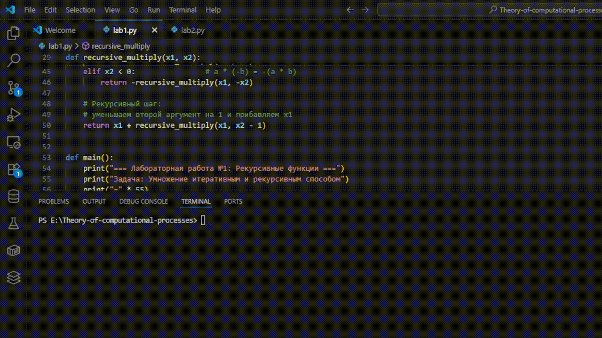
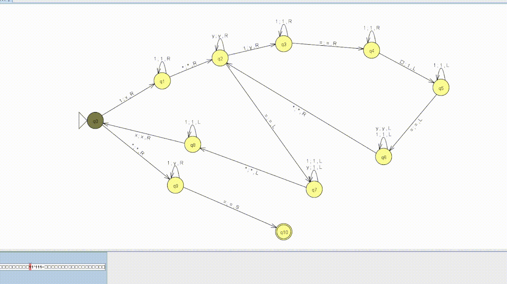
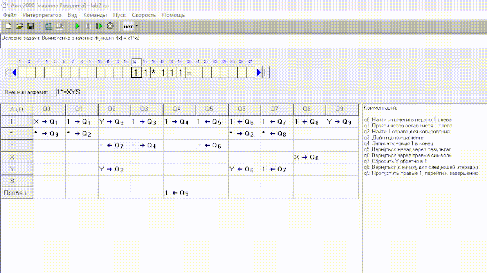

# 🧮 Theory of Computation – Course Labs

This repository contains the coursework for **Theory of Computation**, covering both practical labs and theoretical concepts.  
Each lab folder contains the implementation, and the `gif-files/` directory contains execution demos and visualizations.

---

## 📚 Labs Overview

### 🔹 Lab 1: Recursion Functions
The first lab explores **recursion** as a fundamental computational process.  
It demonstrates:
- Recursive multiplication functions
- Base cases, recursive cases, and termination conditions
- Comparison with iterative approaches

**Execution Demo:**

---

### 🔹 Lab 2: Turing Machine
The second lab introduces the concept of a **Turing Machine** as a model of computation.  
It includes:
- A programmatic implementation (`lab2.cpp`)
- Simulations in **JFLAP**
- Algorithmic trace in **Algo200**

**Execution Demos:**

1. **VS Console – Running `lab2.cpp`**  
   

2. **JFLAP Simulation**  
   

3. **Algo200 Visualization**  
   

